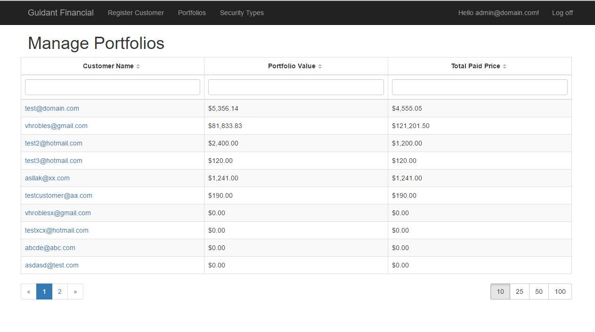

## Customer Portfolio Manager

This is a test application that manages customers, creates a portfolio per user and can add financial securities for them. The database is seeded if the database is new, the default user is admin@domain.com and password: Password1

## Requirements

If you're using Visual Studio and .NET:

The following is required to support the backend services:

Visual Studio 2015 Community (free version) - https://www.visualstudio.com

ASP.NET MVC and Web API are used for the back-end services along with Entity Framework for database access (included if you have VS 2015 community installed with the LocalDB option selected)

To get started, double-click the GuidantFinancial.sln file located at the root of the NET-Core--EF7-with-Angular repository. Once the solution loads press F5 to run the project.

Note: If you want to use Visual Studio 2013 that should work although you may have to change the connection string in web.config from "MSSqlLocalDB" to "v11.0" depending upon which version of LocalDB you have installed.

